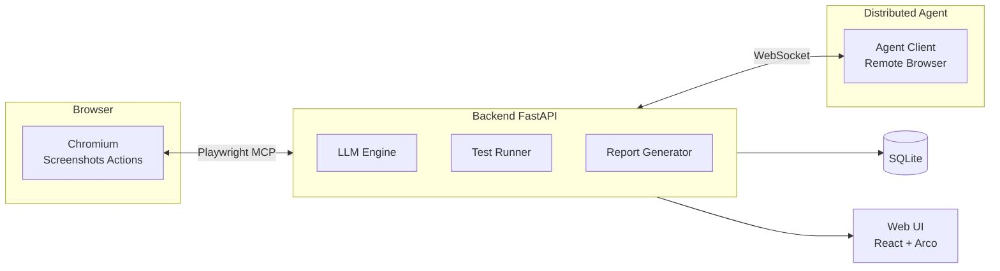

<p align="center">
  <em>Write tests in natural language, let AI drive the browser</em>
</p>

<p align="center">
  <a href="#"></a>
  <a href="#"></a>
  <a href="#"></a>
  <a href="#"></a>
  <a href="./README.md"></a>
</p>

---

VoyanTest is an **AI-powered Web UI testing platform**. Write test steps in **natural language** (Chinese or English), and the LLM translates them into Playwright MCP commands to drive a real browser — with automatic screenshot verification.

```
"Click the login button, enter username and password, verify redirect to homepage"
  ↓ LLM translates
Playwright: click #login-btn → fill #username → fill #password → click #submit → assert URL
```

## ✨ Features

- **🧠 AI Test Generation**: Upload requirement documents (docx/pdf/md/images), AI automatically extracts features, splits steps, and matches expected results
- **🗣️ Natural Language Driven**: Write "click login button" in plain language — no Playwright API knowledge needed
- **🖥️ Real Browser**: Controls Chromium via `@playwright/mcp`, supporting navigate, click, fill, screenshot, and more
- **🔍 Expected Result Verification**: Auto-screenshots after execution, LLM compares screenshots to verify results
- **📋 Execution Plan Preview**: Visual preview of LLM's understanding of each step before execution
- **📊 Test Reports**: Detailed logs + step screenshots + summary statistics
- **🌐 Distributed Execution**: Agent mechanism distributes tests to remote machines
- **🔐 Auth & Permissions**: Admin/tester roles, session management, password security
- **🌗 Dark Theme**: Light/dark theme toggle

## 🚀 Quick Start

### Install

```bash
# Linux
python3 -m venv venv && source venv/bin/activate
pip install -r requirements.txt
playwright install chromium
cd frontend && npm install && npm run build && cd ..
```

```powershell
# Windows
python -m venv myenv && myenv\Scripts\activate
pip install -r requirements_win.txt
playwright install chromium
cd frontend && npm install && npm run build && cd ..
```

### Run

```bash
source venv/bin/activate    # Linux
# myenv\Scripts\activate     # Windows
python3 app/main.py
# or uvicorn app.main:app --host 0.0.0.0 --port 8002 --reload
```

Open `http://localhost:8002/` in your browser. Default admin: `admin / Admin@2024`.

## 📖 Workflow

```
Login → Create Project → Add Module → Write Cases → Run Tests → View Reports
                       ↘ AI Generate ↑                   ↓
                         Upload doc → Preview → Import    Remote Agent
```

**Two ways to create test cases:**
1. **Manual** — Create step by step with natural language steps and expected results
2. **AI Generation** — Upload requirement documents, AI generates cases automatically, preview and import in bulk

Configure your LLM in "Settings → AI Config" before running (supports OpenAI and compatible APIs).

## 🏗️ Architecture



## 🧪 Tech Stack

| Layer | Technology |
|-------|-----------|
| Backend | FastAPI + SQLAlchemy + SQLite |
| Browser Automation | Playwright MCP |
| AI/LLM | OpenAI SDK (any compatible API) |
| Frontend | React 18 + Arco Design Pro + Vite |
| Distributed | WebSocket + Custom Agent Protocol |

## 📦 Project Structure

```
VoyanTest/
├── app/          # FastAPI backend
│   ├── gen/      # AI generation engine (orchestrator / analyzer / feature_extractor)
│   ├── models/   # Domain models (agent / auth / batch / config / gen / project / testcase)
│   └── routers/  # API routes (including gen/ sub-routes)
├── frontend/     # React frontend source
├── core/         # Execution engine (runner / llm_wrapper / step_executor)
├── agent/        # Distributed agent client (with pre-built exe)
├── reports/      # Test reports & screenshots
├── docs/         # Documentation
└── tests/        # Unit tests
```

## 📚 Docs

- API Docs: visit `/docs` after starting (Swagger)
- Deployment: see [DEPLOYMENT.md](DEPLOYMENT.md)
- DB Migration: `alembic upgrade head`

## 📄 License

MIT
