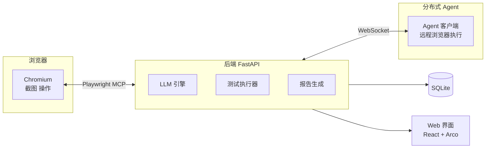

<p align="center">
  <em>用自然语言编写测试，让 AI 驱动浏览器自动执行</em>
</p>

<p align="center">
  <a href="#"></a>
  <a href="#"></a>
  <a href="#"></a>
  <a href="#"></a>
</p>

---

VoyanTest 是一个 **AI 驱动的 Web UI 自动化测试平台**。你只需用**中文自然语言**描述测试步骤，LLM 自动将其翻译为 Playwright MCP 指令并驱动真实浏览器执行，全程自动截图验证预期结果。

```
"点击登录按钮，输入用户名和密码，验证跳转到主页"
  ↓ LLM 翻译
Playwright: click #login-btn → fill #username → fill #password → click #submit → assert URL
```

## ✨ 特性

- **🧠 AI 用例生成**：上传需求文档（docx/pdf/md/图片），AI 自动提取功能点、拆分步骤、匹配预期结果
- **🗣️ 自然语言驱动**：直接写「点击登录按钮」「验证页面标题」等自然语言，无需掌握 Playwright API
- **🖥️ Real Browser**：通过 `@playwright/mcp` 控制 Chromium，支持 navigate、click、fill、screenshot 等全部操作
- **🔍 预期结果验证**：执行后自动截图，LLM 比对截图判断预期结果是否达成
- **📋 执行计划预览**：执行前可视化展示 LLM 对每步的理解和计划操作
- **📊 测试报告**：详细日志 + 步骤截图 + 统计报告
- **🌐 分布式执行**：Agent 机制将测试分发到远程机器并行执行
- **🔐 认证与权限**：管理员/测试人员双角色，会话管理与密码安全策略
- **🌗 深色主题**：亮色/暗色主题切换

## 🚀 快速开始

### 安装依赖

```bash
# Linux
python3 -m venv venv && source venv/bin/activate
pip install -r requirements.txt
playwright install chromium
cd frontend && npm install && npm run build && cd ..
```

```powershell
# Windows
python -m venv myenv && myenv\Scripts\activate
pip install -r requirements_win.txt
playwright install chromium
cd frontend && npm install --ignore-scripts && npm run build && cd ..
```

### 启动服务

```bash
source venv/bin/activate    # Linux
# myenv\Scripts\activate     # Windows
uvicorn app.main:app --host 0.0.0.0 --port 8002 --reload
```

浏览器打开 `http://localhost:8002/`，默认管理员 `admin / Admin@2024`。

### 分布式 Agent

将测试分发到远程机器执行：

```powershell
# 方式一：Python 源码
$env:PLAYWRIGHT_BROWSERS_PATH = "$env:USERPROFILE\AppData\Local\ms-playwright"
python agent/client.py --server http://<服务端IP>:8002

# 方式二：编译版
.\agent\dist\VoyanTest-Agent.exe
```

按提示输入服务端地址，Agent 会自动连接并等待测试任务。

## 📖 工作流程

```
登录 → 创建项目 → 添加模块 → 编写测试用例 → 执行测试 → 查看报告
                      ↘  AI 生成 ↑                   ↓
                        上传文档 → 预览/编辑 → 导入    Agent 远程执行
```

**两种编写方式：**
1. **手动** — 逐条创建，每用例包含步骤（自然语言）和预期结果
2. **AI 生成** — 上传需求文档，AI 自动生成用例，预览编辑后批量导入

> [!TIP]
> 离线环境部署：从 GitHub Releases 下载离线包，见 [DEPLOYMENT.md](DEPLOYMENT.md)

执行前需在「设置 → AI 配置」填写 LLM 信息（支持 OpenAI 及兼容 API）。

## 🏗️ 架构



## 🧪 技术栈

| 层级 | 技术 |
|------|------|
| 后端 | FastAPI + SQLAlchemy + SQLite |
| 浏览器自动化 | Playwright MCP |
| AI/LLM | OpenAI SDK（兼容任意 API） |
| 前端 | React 18 + Arco Design Pro + Vite |
| 分布式 | WebSocket + 自定义 Agent 协议（支持编译版客户端） |

## 📦 项目结构

```
VoyanTest/
├── app/              # FastAPI 后端（routers / models / auth）
├── frontend/         # React 前端源码
├── core/             # 执行引擎（runner / llm_wrapper / step_executor）
├── agent/            # 分布式 Agent 客户端
│   └── dist/         # 编译版 Agent 可执行文件
├── reports/          # 测试报告与截图
├── docs/             # 文档
└── tests/            # 单元测试
```

## 📚 文档

- API 文档：启动后访问 `/docs`（Swagger）
- 离线部署：见 [DEPLOYMENT.md](DEPLOYMENT.md)
- 数据库迁移：`alembic upgrade head`

## 📄 许可证

MIT
