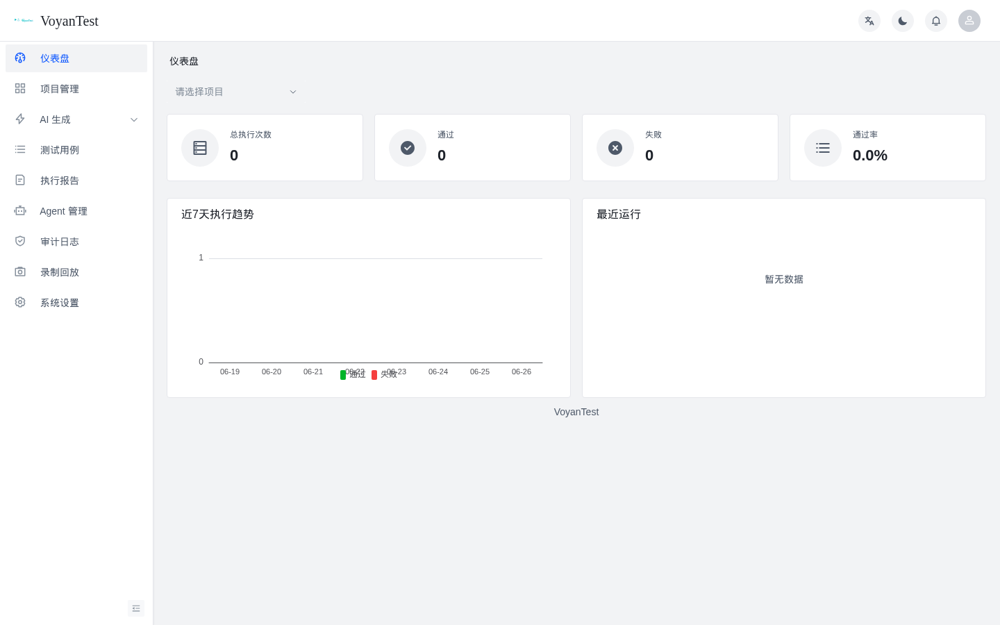
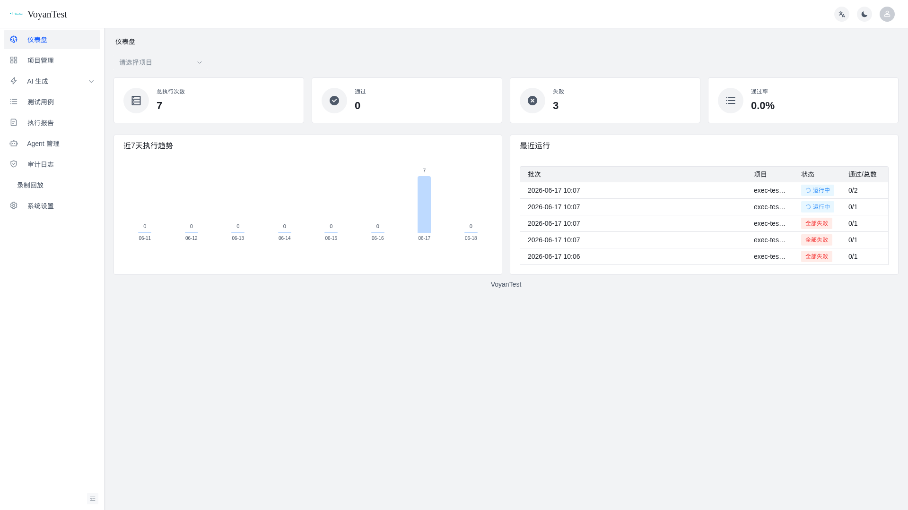
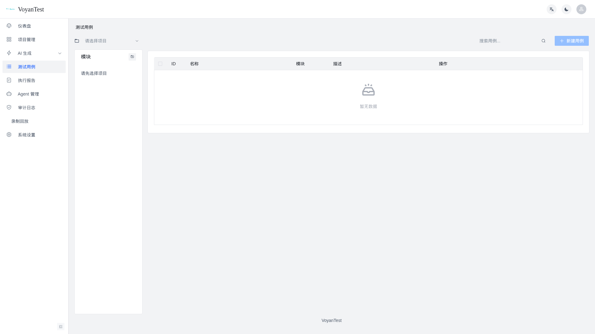
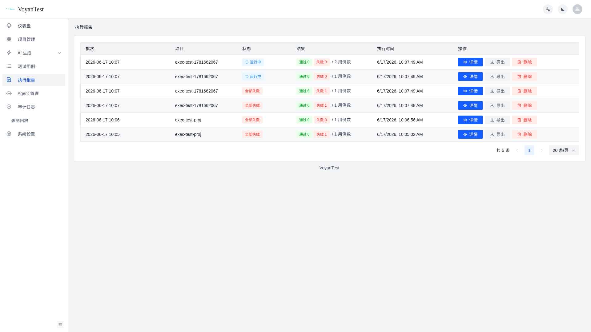
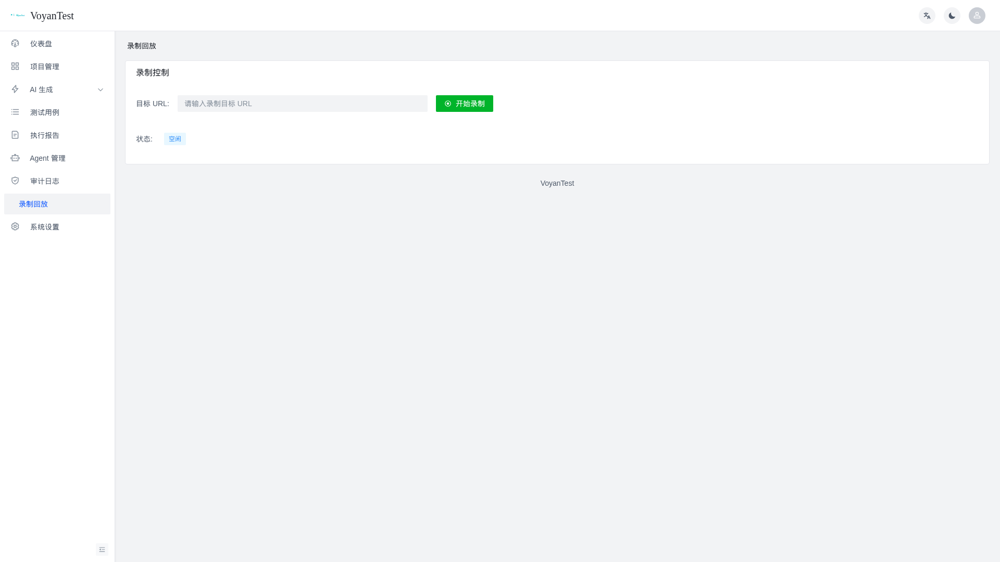
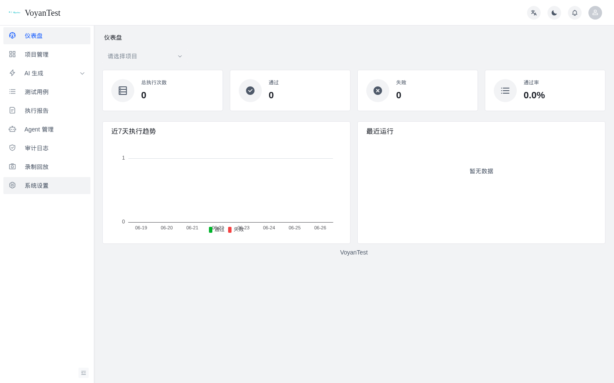
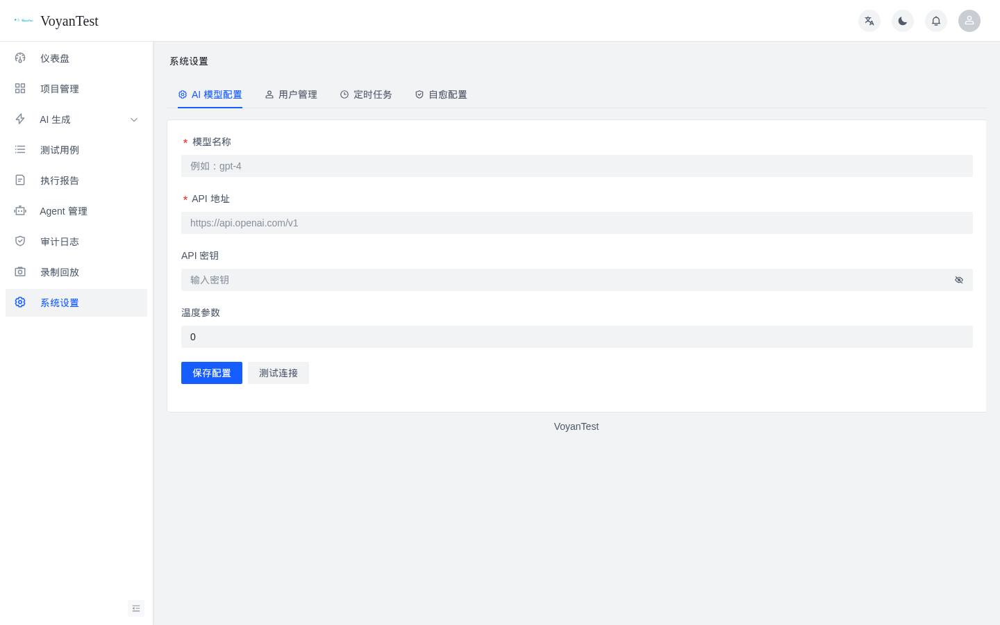
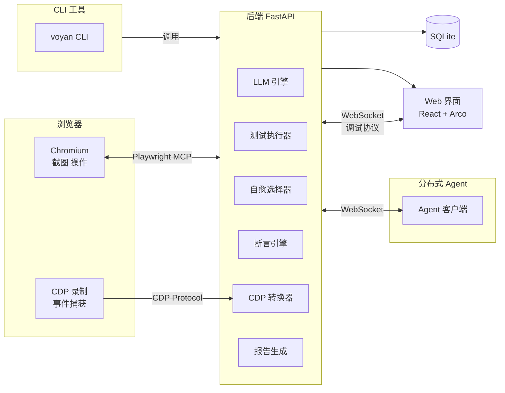

<p align="center">
  <em>用自然语言编写测试，让 AI 驱动浏览器自动执行</em>
</p>

<p align="center">
  <a href="#"></a>
  <a href="#"></a>
  <a href="#"></a>
  <a href="#"></a>
</p>

---

VoyanTest 是一个 **AI 驱动的 Web UI 自动化测试平台**。你只需用**中文自然语言**描述测试步骤，LLM 自动将其翻译为 Playwright MCP 指令并驱动真实浏览器执行，全程自动截图验证预期结果。

```
"点击登录按钮，输入用户名和密码，验证跳转到主页"
  ↓ LLM 翻译
Playwright: click #login-btn → fill #username → fill #password → click #submit → assert URL
```

## ✨ 特性

### 测试执行
- **🗣️ 自然语言驱动**：用中文写「点击登录按钮」「验证页面标题」，LLM 翻译为 Playwright 操作
- **🖥️ Real Browser**：通过 `@playwright/mcp` 控制 Chromium，支持全部浏览器操作
- **🐛 交互式调试**：失败时暂停执行，实时查看浏览器状态，手动选择重试/跳过/编辑步骤继续
- **🔧 自动重试**：步骤级配置重试次数和间隔，自动处理 flaky 测试
- **✅ 步骤断言**：5 种断言类型（URL/文本/元素可见/输入值/元素数量），中文自然语言配置
- **🧠 自愈选择器**：元素定位失败时 AI 自动分析 DOM 找到替代选择器，减少人工维护
- **📹 CDP 录制**：录制真实浏览器操作 → 转换为测试步骤 → 保存为用例 → 一键回放
- **📊 xlsx 导入导出**：测试用例支持 Excel 批量导入导出
- **📈 趋势图**：Dashboard 7 日通过/失败堆叠柱状图（ECharts）
- **🔔 通知中心**：批次运行完成自动通知，支持铃铛图标查看
- **🔑 API Key**：个人 API 密钥管理，支持 CLI/第三方集成
- **🛡️ CSRF 防护**：Double Submit Cookie 模式，所有写入请求自动校验

### AI 驱动
- **📝 AI 用例生成**：上传需求文档（docx/pdf/md/图片），AI 自动提取功能点生成测试用例
- **🔍 预期结果验证**：执行后自动截图，LLM 比对截图判断预期结果是否达成
- **📋 执行计划预览**：执行前可视化展示 LLM 对每步的理解和计划操作

### 平台能力
- **🔐 项目级权限**：admin 全项目，tester 可限制到指定项目，多团队安全隔离
- **📊 测试报告**：批次聚合报告、趋势分析、统计大盘、JSON 导出
- **🌐 分布式执行**：Agent 机制将测试分发到远程机器并行执行
- **🖥️ CLI 工具**：`voyan run` 命令行执行，支持 CI/CD 流水线集成，退出码标准
- **🌗 深色主题**：亮色/暗色主题切换
- **🎬 CDP 录制回放**：录制真实浏览器操作，一键转换为可执行的测试步骤

## 🚀 快速开始

### 安装依赖

```bash
# Linux
python3 -m venv venv && source venv/bin/activate
pip install -r requirements.txt
playwright install chromium
cd frontend && npm install && npm run build && cd ..
```

```powershell
# Windows
python -m venv myenv && myenv\Scripts\activate
pip install -r requirements_win.txt
playwright install chromium
cd frontend && npm install --ignore-scripts && npm run build && cd ..
```

### 启动服务

```bash
source venv/bin/activate    # Linux
# myenv\Scripts\activate     # Windows
uvicorn app.main:app --host 0.0.0.0 --port 8002 --reload
```

浏览器打开 `http://localhost:8002/`，默认管理员 `admin / Admin@2024`。

## 🧭 主流程

### 1. 登录

输入用户名密码（默认 `admin / Admin@2024`），进入仪表盘。

| 登录 | 仪表盘 |
|------|--------|
|  |  |

### 2. 创建项目 → 编写用例 → 执行测试

```
登录 → 创建项目 → 添加模块 → 编写测试用例 → 执行测试 → 查看报告
                  ↘ AI 生成 ↑                   ↘ Agent 远程执行
```

**两种方式编写用例：**
- **手动** — 在「测试用例」页逐条创建，自然语言描述步骤和预期结果
- **AI 生成** — 上传需求文档（docx/pdf/md/图片），AI 自动提取功能点生成用例

| 测试用例管理 | 执行报告 |
|-------------|---------|
|  |  |

### 3. CDP 录制回放

在「录制回放」页录制真实浏览器操作，自动转换为可执行的测试步骤。支持**保存到用例库**、**历史录制管理**和**一键回放**：

| 录制控制 | 事件与转换 |
|---------|-----------|
|  | 输入 URL → 开始录制 → 操作浏览器 → 停止 → 转换为测试步骤 → 保存/回放 |

### 4. AI 用例生成

上传需求文档（docx/pdf/md/图片），AI 自动提取功能点并生成测试用例。

| AI 生成页面 |
|------------|
|  |

### 5. AI 配置

执行前需在「系统设置 → AI 模型配置」填写 LLM 信息（支持 OpenAI 及兼容 API）。

| AI 配置 |
|---------|
|  |

### 分布式 Agent

将测试分发到远程机器执行：

```powershell
# 方式一：Python 源码
$env:PLAYWRIGHT_BROWSERS_PATH = "$env:USERPROFILE\AppData\Local\ms-playwright"
python agent/client.py --server http://<服务端IP>:8002

# 方式二：编译版
.\agent\dist\VoyanTest-Agent.exe
```

按提示输入服务端地址，Agent 会自动连接并等待测试任务。

## 📖 工作流程

```
登录 → 创建项目 → 添加模块 → 编写测试用例 → 执行测试 → 查看报告
                      ↘  AI 生成 ↑                   ↓
                        上传文档 → 预览/编辑 → 导入    Agent 远程执行
```

**两种编写方式：**
1. **手动** — 逐条创建，每用例包含步骤（自然语言）和预期结果
2. **AI 生成** — 上传需求文档，AI 自动生成用例，预览编辑后批量导入

> [!TIP]
> 离线环境部署：从 GitHub Releases 下载离线包，见 [DEPLOYMENT.md](DEPLOYMENT.md)

执行前需在「设置 → AI 配置」填写 LLM 信息（支持 OpenAI 及兼容 API）。

## 🏗️ 架构



## 🧪 技术栈

| 层级 | 技术 |
|------|------|
| 后端 | FastAPI + SQLAlchemy + SQLite/PostgreSQL |
| 浏览器自动化 | Playwright MCP |
| AI/LLM | OpenAI SDK（兼容任意 API） |
| 前端 | React 18 + Arco Design Pro + Vite + ECharts |
| 实时通信 | WebSocket（执行日志 + 调试协议 + 重连 3 态指示） |
| 分布式 | WebSocket + 自定义 Agent 协议 |
| CLI | argparse + asyncio（退出码标准） |

## 📦 项目结构

```
VoyanTest/
├── app/              # FastAPI 后端
│   ├── gen/          # AI 生成引擎
│   ├── middleware/    # 中间件（CSRF 等）
│   ├── models/       # 领域模型（auth / project / testcase / batch / recording / notification 等）
│   ├── services/     # 服务层（通知、报告等）
│   └── routers/      # API 路由（含 run-debug 调试端点、录制历史、通知中心）
├── core/             # 执行引擎
│   ├── runner/            # 测试执行器（含重试/暂停/自愈）
│   ├── assertions.py      # 步骤断言引擎（5 种类型）
│   ├── self_healing.py    # AI 自愈选择器
│   ├── llm_wrapper.py     # LLM 客户端封装
│   ├── step_executor.py   # MCP 步骤执行
│   ├── cdp_session.py     # CDP 录制会话引擎
│   └── cdp_converter.py   # CDP 事件→测试步骤转换

...
├── frontend/         # React 前端
│   └── src/pages/
│       ├── recordings/    # CDP 录制回放（含历史/保存对话框）
│       ├── run-debug/     # 交互式调试执行（含 WS 重连状态）
│       ├── testcases/     # 用例管理（含断言编辑器、xlsx 导入导出）
│       ├── reports/       # 报告（含对比弹窗）
│       ├── agents/        # Agent 管理（含详情页）
│       ├── audit-logs/    # 审计日志（结构化 JSON 展示）
│       └── settings/      # 系统设置（含自愈配置 Tab）
├── agent/            # 分布式 Agent 客户端
├── voyan_cli.py      # CLI 命令行工具（voyan run / list / run-single）
├── alembic/          # 数据库迁移
├── tests/            # 单元 + 契约 + E2E 测试（1400+ 条）
├── reports/          # 测试报告与截图
└── docs/             # 文档
```

## 📚 文档

- API 文档：启动后访问 `/docs`（Swagger）
- 离线部署：见 [DEPLOYMENT.md](DEPLOYMENT.md)
- 数据库迁移：`alembic upgrade head`

## 📄 许可证

MIT
